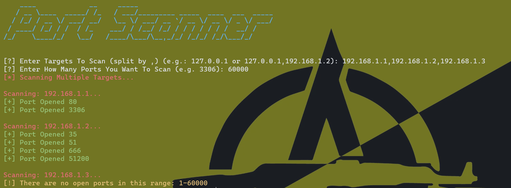

# Port Scanner
A port scanner tool to scan the open ports in specific targets.



# Installation
```
pip install -r primo-pipreqs.txt
```
or
```
pip3 install -r primo-pipreqs.txt
```

# Usage
```
python app.py
```
or
```
python3 app.py
```

And specify target ip and number of ports that you want to scan.
